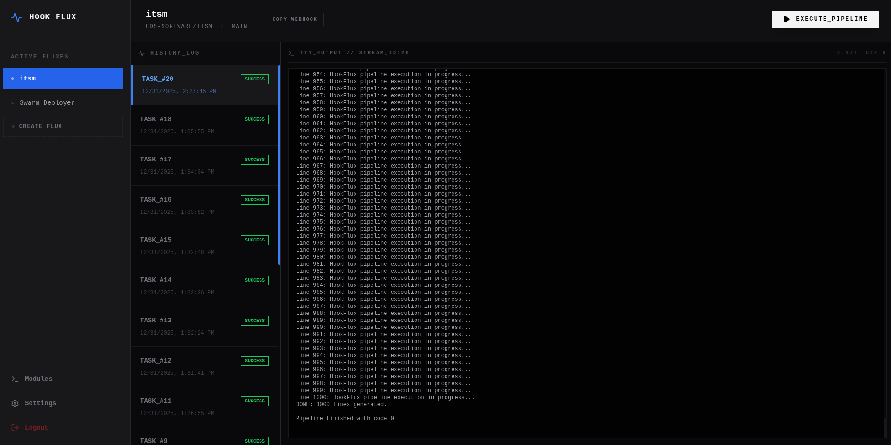

# HookFlux: Orchestrate Your Infrastructure with Signal-Driven Pipelines

[](LICENSE)



HookFlux is a high-performance, self-hosted automation engine designed to transform external webhooks into complex, multi-step execution flows. Built for developers who demand the control of local bash scripts with the elegance of a modern TUI, HookFlux turns simple signals into sophisticated infrastructure orchestration.

## The HookFlux Philosophy: Fluxes and Modules

HookFlux operates on a clean, powerful abstraction that eliminates repetitive scripting:

- **Modules (The Lego Bricks)**: Define your core logic once. Modules are reusable bash templates with dynamic IO parameters. Build a "Docker Build" module, a "Database Migration" module, or a "Discord Notify" module and use them everywhere.
- **Fluxes (The Neural Paths)**: Chain your modules together to create a **Flux**. A Flux is a high-level pipeline triggered by a unique, slug-based webhook. It's the "flow" of your deployment or automation logic.

## Engineering Highlights

### Visual Pipeline Architect
Construct execution chains with an intuitive drag-and-drop builder. Link modules, reorder steps on the fly, and configure localized variables via dedicated configuration overlays.

### Intelligent Parameter Validation
Never trigger a broken pipeline again. HookFlux proactively scans your Flux configurations, highlighting missing parameters and incomplete setups with high-visibility alerts before you even commit your changes.

### Zero-Latency TTY Streaming
Experience your automation in real-time. HookFlux leverages Socket.io to stream raw terminal output directly to a specialized TUI dashboard. Every line, error, and exit code is delivered with sub-millisecond latency.

### Searchable Module Library
Quickly scale your operations by pulling from a centralized library of execution blocks. Preview required parameters and internal logic instantly via a searchable, high-contrast overlay.

### Production-Grade Persistence & Maintenance
- **Hybrid Log Engine**: Metadata lives in SQLite for lightning-fast lookups, while raw logs are streamed to disk for full-fidelity auditing.
- **Auto-Maintenance**: Built-in 30-day retention policies and database compaction ensure HookFlux remains lean and fast, even under heavy load.
- **Export Compatibility**: Export your Flux configurations directly to standard `adnanh/webhook` JSON for cross-platform portability.

## Technical Architecture

HookFlux is engineered for speed and stability:
- **Core**: Node.js & Express 5.
- **Real-time**: Socket.io bidirectional streaming.
- **UI**: React 19 + Vite + Tailwind CSS (Optimized TUI Aesthetic).
- **Security**: HMAC-SHA256 Payload Verification + JWT Authentication.
- **Packaging**: Multi-stage Docker image with integrated Git and Docker CLI.

## Configuration

Control HookFlux behavior via environment variables:
- `ADMIN_PASSWORD`: Access key for the TUI dashboard.
- `JWT_SECRET`: Secret used for signing authentication tokens.
- `PIPELINE_TIMEOUT`: Maximum execution time for a Flux in minutes (Default: `10`).
- `DATA_DIR`: Path to the SQLite database directory.
- `LOGS_DIR`: Path to the raw execution logs directory.
- `SSH_DIR`: Path to the system SSH key directory.

## Installation & Deployment

HookFlux is designed to run anywhere you can execute a shell.

### Method 1: Ubuntu VM (Recommended for Standalone)
Use our automated setup script for a production-ready environment with Nginx and SSL:
```bash
git clone https://github.com/yourusername/hookflux.git
cd hookflux
sudo ./deployment/ubuntu/setup.sh your-domain.com
```
See the [Ubuntu Deployment Guide](deployment/ubuntu/README.md) for details.

### Method 2: Docker Swarm
Launch as a stack in seconds:
```bash
docker stack deploy -c docker-stack.yml hookflux
```

## How to Scale Your Workflow

1. **Craft Your Modules**: Write your bash logic in the Module Manager using `{{VARIABLE}}` placeholders.
2. **Build Your Flux**: Compose a pipeline by picking modules from your library.
3. **Configure the Chain**: Hit the cog icon on each step to inject project-specific data.
4. **Link the Signal**: Paste your unique Flux endpoint into GitHub or any webhook provider.
5. **Watch the Magic**: Deployments, backups, and notifications now run on autopilot with live terminal feedback.

HookFlux: Stop writing scripts. Start building flows.
